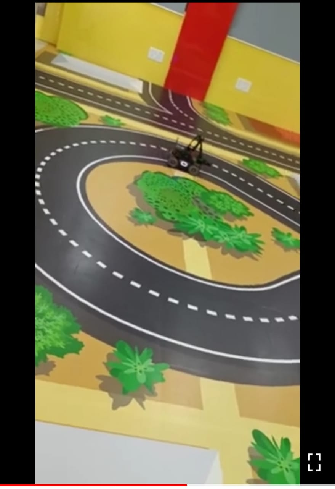
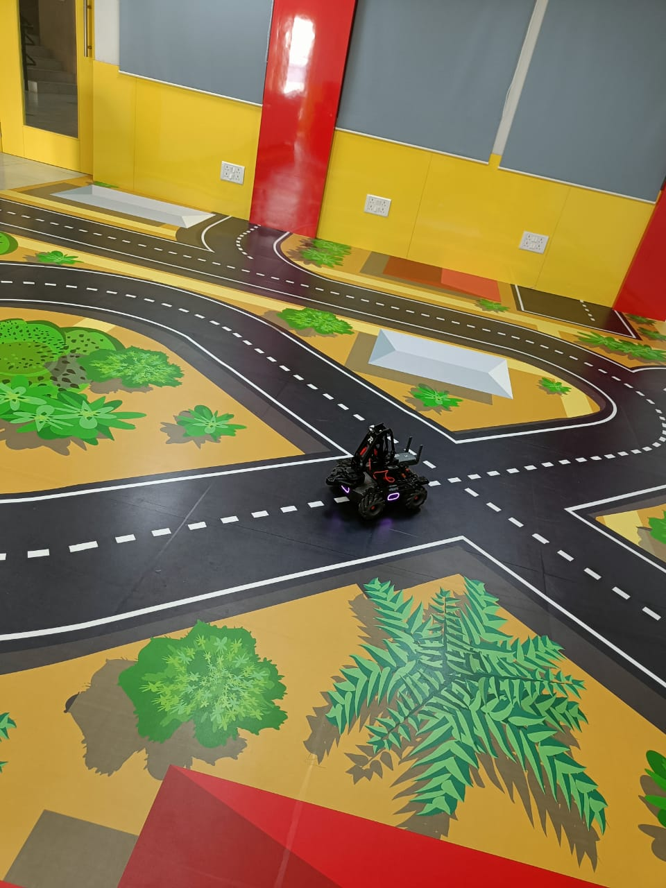
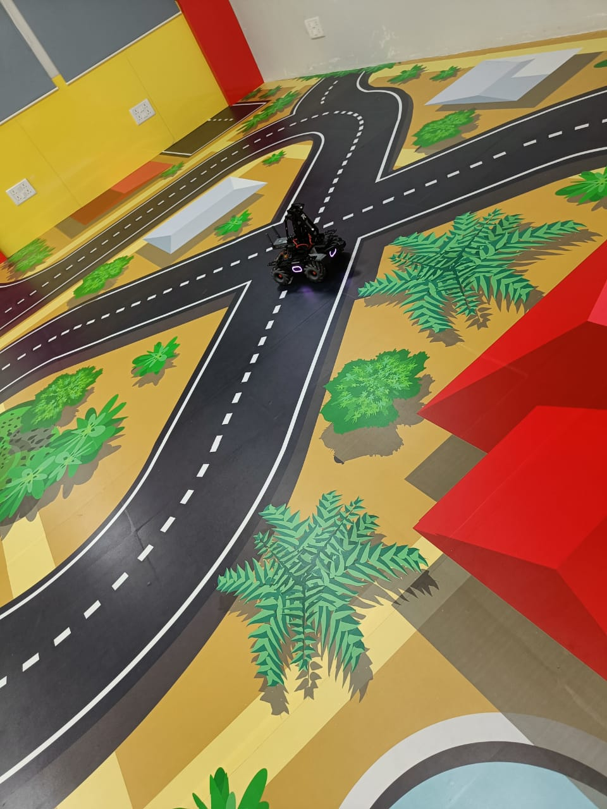

# MobileRobot-Openloopcontrol
## Aim:

To develop a python control code to move the mobilerobot along the predefined path.

## Equipments Required:
1. RoboMaster EP core
2. Python 3.7

## Procedure

Step1:

Use from robomaster import robot

Step2:

Choose the x,y,z - axis movement distance(meters).

Step3:

Give ep_chasis.move to move straight

Step4:

Give ep_chasis.drive to get circular motion.


Step5:

Give ep_chasis.move to move straight

Step 6:

Give ep_chasis.drive to get circular motion.


## Program
```python
from robomaster import robot
import time

from robomaster import robot
import time

if _name_ == '_main_':
    ep_robot = robot.Robot()
    ep_robot.initialize(conn_type="ap")

    ep_chassis = ep_robot.chassis

    '''
    x = x-axis movement distance,( meters) [-5,5]
    y = y-axis movement distance,( meters) [-5,5]
    z = rotation about z axis ( degree)[-180,180]
    xy_speed = xy axis movement speed,( unit meter/second) [0.5,2]
    '''
    ep_chassis.move(x=1.5, y=0, z=0, xy_speed=1.5).wait_for_completed()
    ep_chassis.drive_speed(x=0.60,y=0,z=30)
    time.sleep(8)
    ep_chassis.move(x=0.5, y=0, z=0, xy_speed=1).wait_for_completed()
    ep_chassis.drive_speed(x=0.25,y=0,z=10)
    time.sleep(6)
      

    ep_robot.close()
      


    
    ep_robot.close()
```

## MobileRobot Movement Image:



Insert image here



<br/>
<br/>
<br/>
<br/>

## MobileRobot Movement Video:

Upload your video in Youtube and paste your video-id here

(https://youtu.be/Wod5hq71pHs)

<br/>
<br/>
<br/>
<br/>

## Result:
Thus the python program code is developed to move the mobilerobot in the predefined path.


<br/>
<br/>

```
Mobile Robotics Laboratory
Department of Artificial Intelligence and Data Science/ Machine Learning
Saveetha Engineering College
```
